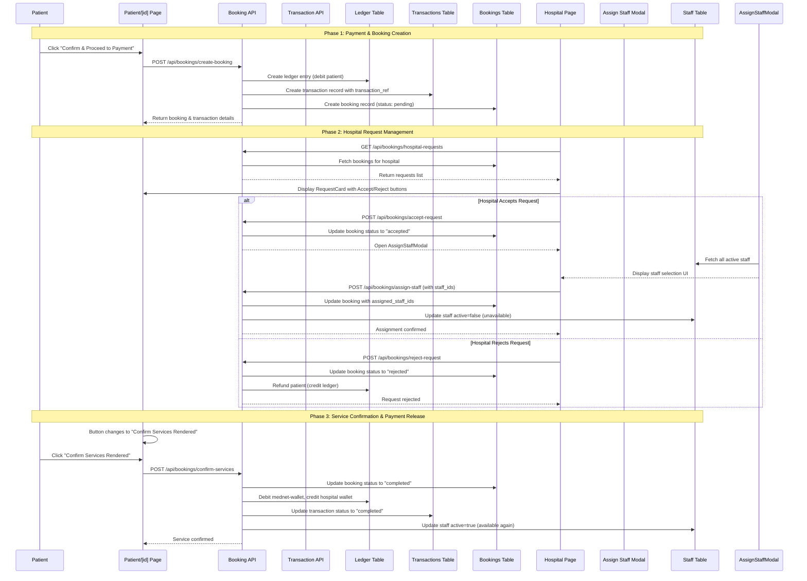
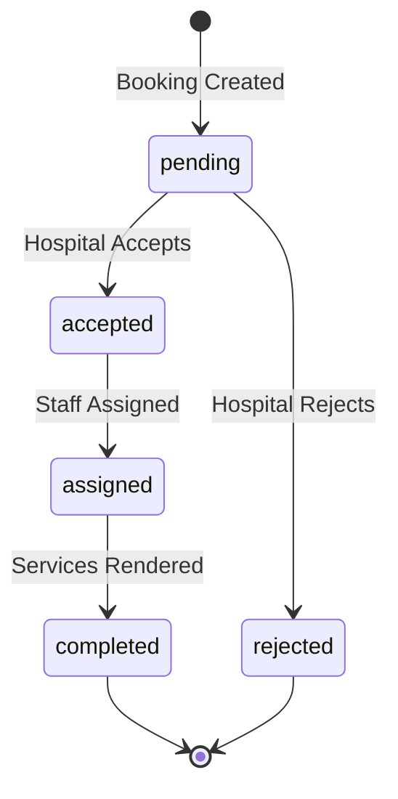

# Booking and Payment Workflow Implementation Plan

## Overview
This plan outlines the implementation of a complete booking and payment workflow for the MedNet platform, involving patients, hospitals, and staff members. The workflow handles payment simulation, transaction creation, request management, staff assignment, and service confirmation.

## Database Tables Involved
- **transactions**: Stores transaction records with transaction_ref, amount, patient_id, hospital_id, status
- **bookings**: Stores booking records with patient_id, hospital_id, assigned_staff_id, status, fee
- **ledger**: Tracks wallet ledger entries for mednet-wallet
- **staff**: Staff members with active field (true=active, false=unavailable)
- **wallets**: User wallet balances
- **wallet_transactions**: Wallet transaction records

## Workflow Diagram



## Booking Status Flow



## Implementation Tasks

### 1. Service Layer Functions

#### 1.1 Create `lib/bookingService.ts`
- `createBooking(patientId, hospitalId, amount, details)` - Creates new booking
- `getHospitalRequests(hospitalId)` - Fetches pending/accepted bookings for hospital
- `acceptBooking(bookingId)` - Updates booking status to accepted
- `rejectBooking(bookingId)` - Rejects booking and refunds patient
- `assignStaffToBooking(bookingId, staffIds)` - Assigns staff to booking
- `confirmServicesRendered(bookingId)` - Completes booking and releases payment

#### 1.2 Create `lib/transactionService.ts`
- `createTransaction(patientId, hospitalId, amount)` - Creates transaction with transaction_ref
- `updateTransactionStatus(transactionId, status)` - Updates transaction status
- `getTransactionByRef(transactionRef)` - Fetches transaction by reference

#### 1.3 Create `lib/ledgerService.ts`
- `createLedgerEntry(ownerId, ownerType, amount, entryType, transactionId, description)`
- `refundLedgerEntry(transactionId)` - Refunds a ledger entry

### 2. API Routes

#### 2.1 POST `/api/bookings/create-booking`
**Request Body:**
```typescript
{
  hospitalId: string,
  amount: number,
  preferredDate: string,
  preferredTime: string,
  medicalHistory?: string
}
```

**Response:**
```typescript
{
  success: true,
  booking: Booking,
  transaction: Transaction,
  transactionRef: string
}
```

**Logic:**
1. Verify patient authentication
2. Generate unique transaction_ref (e.g., TXN-{timestamp}-{random})
3. Create transaction record in `transactions` table
4. Create ledger entry debiting patient wallet (mednet-wallet)
5. Create booking record in `bookings` table with status "pending"
6. Return booking and transaction details

#### 2.2 GET `/api/bookings/hospital-requests`
**Response:**
```typescript
{
  requests: Array<{
    booking: Booking,
    patient: Profile,
    transaction: Transaction
  }>
}
```

**Logic:**
1. Verify hospital authentication
2. Fetch bookings where hospital_id matches
3. Join with patient profiles and transactions
4. Return list of requests

#### 2.3 POST `/api/bookings/accept-request`
**Request Body:**
```typescript
{
  bookingId: string
}
```

**Response:**
```typescript
{
  success: true,
  booking: Booking
}
```

**Logic:**
1. Verify hospital authentication
2. Update booking status to "accepted"
3. Return updated booking

#### 2.4 POST `/api/bookings/reject-request`
**Request Body:**
```typescript
{
  bookingId: string
}
```

**Response:**
```typescript
{
  success: true,
  booking: Booking
}
```

**Logic:**
1. Verify hospital authentication
2. Update booking status to "rejected"
3. Create refund ledger entry crediting patient wallet
4. Return updated booking

#### 2.5 POST `/api/bookings/assign-staff`
**Request Body:**
```typescript
{
  bookingId: string,
  staffIds: string[]
}
```

**Response:**
```typescript
{
  success: true,
  booking: Booking
}
```

**Logic:**
1. Verify hospital authentication
2. Update booking with assigned_staff_ids (store as array or JSON)
3. Update each staff member's `active` field to `false`
4. Return updated booking

#### 2.6 POST `/api/bookings/confirm-services`
**Request Body:**
```typescript
{
  bookingId: string
}
```

**Response:**
```typescript
{
  success: true,
  booking: Booking,
  transaction: Transaction
}
```

**Logic:**
1. Verify patient authentication
2. Update booking status to "completed"
3. Debit mednet-wallet ledger entry
4. Credit hospital wallet
5. Update transaction status to "completed"
6. Update assigned staff `active` field to `true`
7. Return updated booking and transaction

### 3. UI Components

#### 3.1 Create `components/hospital/RequestCard.tsx`
**Props:**
```typescript
interface RequestCardProps {
  booking: Booking;
  patient: Profile;
  transaction: Transaction;
  onAccept: (bookingId: string) => void;
  onReject: (bookingId: string) => void;
}
```

**Features:**
- Display patient name, hospital, amount, preferred date/time
- Show transaction reference
- Accept/Reject buttons
- Status badge

#### 3.2 Create `components/hospital/AssignStaffModal.tsx`
**Props:**
```typescript
interface AssignStaffModalProps {
  isOpen: boolean;
  onClose: () => void;
  staffList: Staff[];
  selectedStaffIds: string[];
  onStaffSelectionChange: (staffIds: string[]) => void;
  onAssign: () => void;
}
```

**Features:**
- Display list of active staff members
- Multi-select functionality with checkboxes
- Input field showing selected staff (removable)
- Assign button to confirm selection

#### 3.3 Update `components/StaffCard.tsx`
**Features:**
- Display active/unavailable status badge
- Color-coded status (green=active, gray=unavailable)

### 4. Page Updates

#### 4.1 Update `app/dashboard/patient/hospitals/[id]/page.tsx`
**Changes:**
1. Add state for booking status and transaction reference
2. Implement payment confirmation handler
3. Add "Confirm Services Rendered" button (shown when booking is assigned)
4. Display transaction reference to user
5. Update button text based on booking status

**Button States:**
- Initial: "Confirm & Proceed to Payment"
- After payment (pending): "Waiting for hospital acceptance..."
- After assignment: "Confirm Services Rendered"
- After completion: "Services Completed"

#### 4.2 Update `app/dashboard/hospital/page.tsx`
**Changes:**
1. Fetch and display incoming requests
2. Render RequestCard components
3. Handle accept/reject actions
4. Open AssignStaffModal on accept
5. Handle staff assignment

#### 4.3 Update `app/dashboard/hospital/staffs/page.tsx`
**Changes:**
1. Display staff status (active/unavailable)
2. Filter or highlight unavailable staff

## Key Design Decisions

### Transaction Reference Format
- Format: `TXN-{timestamp}-{random}` (e.g., TXN-1711468800-ABC123)
- Stored in `transactions.transaction_ref` field
- Visible to all parties for reference

### Staff Status Management
- Use existing `active` field in `staff` table
- `active: true` = Available for assignments
- `active: false` = Currently assigned/unavailable

### Booking Status Values
- `pending` - Initial state after payment
- `accepted` - Hospital accepted, awaiting staff assignment
- `assigned` - Staff assigned to booking
- `rejected` - Hospital rejected the request
- `completed` - Services rendered and payment released

### Multiple Staff Assignment
- Store assigned_staff_ids as JSON array in bookings table
- Update multiple staff records' `active` field on assignment
- Reactivate all staff when booking completes

### Ledger Entry Types
- `debit` - Money leaving a wallet
- `credit` - Money entering a wallet
- `refund` - Money returned to patient on rejection

## File Structure

```
mednet/
├── app/
│   ├── api/
│   │   └── bookings/
│   │       ├── create-booking/
│   │       │   └── route.ts
│   │       ├── hospital-requests/
│   │       │   └── route.ts
│   │       ├── accept-request/
│   │       │   └── route.ts
│   │       ├── reject-request/
│   │       │   └── route.ts
│   │       ├── assign-staff/
│   │       │   └── route.ts
│   │       └── confirm-services/
│   │           └── route.ts
│   ├── dashboard/
│   │   ├── hospital/
│   │   │   ├── page.tsx (updated)
│   │   │   └── staffs/
│   │   │       └── page.tsx (updated)
│   │   └── patient/
│   │       └── hospitals/
│   │           └── [id]/
│   │               └── page.tsx (updated)
│   └── mednet-wallet/
│       └── page.tsx (may need updates for ledger display)
├── components/
│   └── hospital/
│       ├── RequestCard.tsx (new)
│       └── AssignStaffModal.tsx (new)
├── lib/
│   ├── bookingService.ts (new)
│   ├── transactionService.ts (new)
│   └── ledgerService.ts (new)
└── plans/
    └── booking-payment-workflow.md (this file)
```

## Database Schema Notes

### transactions table (ensure transaction_ref exists)
```sql
ALTER TABLE transactions ADD COLUMN IF NOT EXISTS transaction_ref TEXT UNIQUE;
```

### bookings table (may need updates for multiple staff)
```sql
ALTER TABLE bookings ADD COLUMN IF NOT EXISTS assigned_staff_ids TEXT[];
-- or use JSONB:
ALTER TABLE bookings ADD COLUMN IF NOT EXISTS assigned_staff_ids JSONB;
```

## Testing Checklist

- [ ] Patient can create booking and pay
- [ ] Transaction reference is generated and displayed
- [ ] Ledger entry is created correctly
- [ ] Hospital sees incoming request
- [ ] Hospital can accept request
- [ ] Hospital can reject request (with refund)
- [ ] Staff modal shows available staff
- [ ] Multiple staff can be selected
- [ ] Staff assignment updates booking
- [ ] Staff status changes to unavailable
- [ ] Patient sees "Confirm Services Rendered" button
- [ ] Service confirmation releases payment to hospital
- [ ] Staff status changes back to available after completion
- [ ] Transaction status updates to completed
