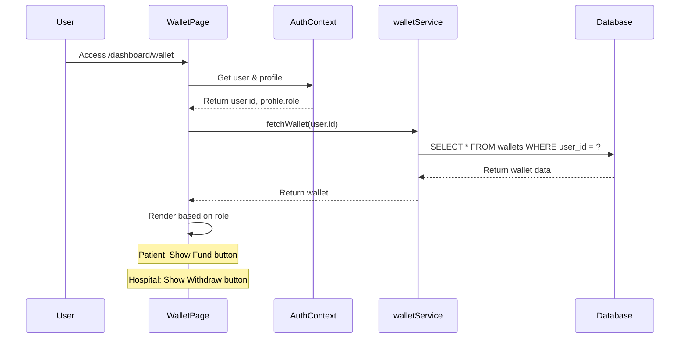

# Combined Wallet Page Architecture

## Overview
Implement a unified wallet page at `/dashboard/wallet` that serves both patients and hospitals with role-based feature toggling. Each user can only access their own wallet.

## Architecture Diagram

```mermaid
graph TB
    subgraph User_Access
        P[Patient User]
        H[Hospital User]
    end
    
    subgraph Dashboard_Route
        W[/dashboard/wallet/page.tsx]
    end
    
    subgraph Components
        WC[WalletCard Component]
        TH[TransactionHistory Component]
        FWM[FundWalletModal - Patients Only]
        WWM[WithdrawWalletModal - Hospitals Only]
    end
    
    subgraph Services
        WS[walletService.ts]
        FW[fetchWallet]
        FT[fetchTransactions]
    end
    
    subgraph Database
        WAL[wallets Table]
        WT[wallet_transactions Table]
        PRO[profiles Table]
    end
    
    P --> W
    H --> W
    W --> WC
    W --> TH
    W --> FWM
    W --> WWM
    WC --> WS
    TH --> WS
    WS --> FW
    WS --> FT
    FW --> WAL
    FT --> WT
    FW --> PRO
```

## Security Flow



## File Structure

```
app/
├── dashboard/
│   ├── wallet/                    # NEW: Combined wallet route
│   │   └── page.tsx
│   ├── patient/
│   │   ├── hospitals/
│   │   │   └── patient-wallet/     # DEPRECATED: Will be removed
│   │   │       └── page.tsx
│   │   └── layout.tsx
│   └── hospital/
│       ├── hospital-wallet/         # DEPRECATED: Will be removed
│       │   └── page.tsx
│       └── layout.tsx
├── api/
│   └── wallet/
│       ├── balance/
│       │   └── route.ts           # GET: Fetch wallet balance
│       ├── fund/
│       │   └── route.ts           # POST: Fund wallet (patients)
│       ├── withdraw/
│       │   └── route.ts           # POST: Withdraw (hospitals)
│       └── transactions/
│           └── route.ts           # GET: Fetch transaction history
components/
└── wallet/
    ├── WalletCard.tsx             # NEW: Reusable wallet card
    ├── TransactionHistory.tsx       # NEW: Transaction list component
    ├── FundWalletModal.tsx         # EXISTING: For patients
    └── WithdrawWalletModal.tsx     # NEW: For hospitals
lib/
└── walletService.ts               # NEW: Unified wallet service
```

## Implementation Steps

### 1. Create Unified Wallet Service (`lib/walletService.ts`)

```typescript
// lib/walletService.ts
import { getSupabaseClient } from "./supabase";
import { Database } from "@/types/supabase";

type Wallet = Database["public"]["Tables"]["wallets"]["Row"];
type WalletTransaction = Database["public"]["Tables"]["wallet_transactions"]["Row"];

export interface WalletWithProfile extends Wallet {
  profile: {
    role: "patient" | "hospital";
    firstname: string | null;
    lastname: string | null;
    hospitalname: string | null;
  };
}

// Fetch wallet for authenticated user (security: only own wallet)
export async function fetchWallet(userId: string): Promise<Wallet | null> {
  const supabase = getSupabaseClient();
  
  const { data, error } = await supabase
    .from("wallets")
    .select("*")
    .eq("user_id", userId)
    .single();
  
  if (error) throw error;
  return data;
}

// Fetch wallet with profile info
export async function fetchWalletWithProfile(userId: string): Promise<WalletWithProfile | null> {
  const supabase = getSupabaseClient();
  
  const { data, error } = await supabase
    .from("wallets")
    .select(`
      *,
      profiles!inner (
        role,
        firstname,
        lastname,
        hospitalname
      )
    `)
    .eq("user_id", userId)
    .single();
  
  if (error) throw error;
  return data as WalletWithProfile;
}

// Fetch transaction history for wallet
export async function fetchWalletTransactions(walletId: string, limit: number = 20) {
  const supabase = getSupabaseClient();
  
  const { data, error } = await supabase
    .from("wallet_transactions")
    .select("*")
    .eq("wallet_id", walletId)
    .order("created_at", { ascending: false })
    .limit(limit);
  
  if (error) throw error;
  return data;
}

// Check if wallet exists, create if not (on user registration)
export async function ensureWalletExists(userId: string) {
  const supabase = getSupabaseClient();
  
  const { data: existingWallet } = await supabase
    .from("wallets")
    .select("id")
    .eq("user_id", userId)
    .single();
  
  if (existingWallet) return existingWallet;
  
  // Create new wallet
  const { data, error } = await supabase
    .from("wallets")
    .insert({
      user_id: userId,
      balance: 0,
      currency: "NGN",
      is_active: true,
    })
    .select()
    .single();
  
  if (error) throw error;
  return data;
}
```

### 2. Create Reusable Wallet Components

#### `components/wallet/WalletCard.tsx`
```typescript
"use client";

import { Database } from "@/types/supabase";
import { CirclePlus, ArrowDownToLine } from "lucide-react";

type Wallet = Database["public"]["Tables"]["wallets"]["Row"];

interface WalletCardProps {
  wallet: Wallet;
  userRole: "patient" | "hospital";
  onFundClick?: () => void;
  onWithdrawClick?: () => void;
}

export default function WalletCard({ wallet, userRole, onFundClick, onWithdrawClick }: WalletCardProps) {
  return (
    <div className="bg-blue-600 px-10 py-6 w-sm m-3 rounded-xl text-white">
      <h1 className="text-lg font-light mb-4 uppercase">Current Balance</h1>
      <p className="text-white font-bold text-4xl pb-8">
        {wallet?.currency}{wallet?.balance.toFixed(2)}
      </p>
      
      <div className="flex gap-3">
        {/* Fund button - Patients only */}
        {userRole === "patient" && onFundClick && (
          <button
            onClick={onFundClick}
            className="flex items-center justify-center gap-2 rounded-md hover:bg-amber-50 cursor-pointer bg-white text-blue-600 font-bold py-2.5 px-3"
          >
            <CirclePlus /> Fund Wallet
          </button>
        )}
        
        {/* Withdraw button - Hospitals only */}
        {userRole === "hospital" && onWithdrawClick && (
          <button
            onClick={onWithdrawClick}
            className="flex items-center justify-center gap-2 rounded-md hover:bg-amber-50 cursor-pointer bg-white text-blue-600 font-bold py-2.5 px-3"
          >
            <ArrowDownToLine /> Withdraw
          </button>
        )}
      </div>
    </div>
  );
}
```

#### `components/wallet/TransactionHistory.tsx`
```typescript
"use client";

import { Database } from "@/types/supabase";

type WalletTransaction = Database["public"]["Tables"]["wallet_transactions"]["Row"];

interface TransactionHistoryProps {
  transactions: WalletTransaction[];
}

export default function TransactionHistory({ transactions }: TransactionHistoryProps) {
  if (!transactions || transactions.length === 0) {
    return (
      <div className="bg-white rounded-xl p-6 shadow-sm">
        <h2 className="text-xl font-semibold mb-4">Transaction History</h2>
        <p className="text-gray-500">No transactions yet.</p>
      </div>
    );
  }

  return (
    <div className="bg-white rounded-xl p-6 shadow-sm">
      <h2 className="text-xl font-semibold mb-4">Transaction History</h2>
      <div className="space-y-3">
        {transactions.map((tx) => (
          <div key={tx.id} className="flex justify-between items-center p-4 border rounded-lg">
            <div>
              <p className="font-medium capitalize">{tx.transaction_type.replace(/_/g, " ")}</p>
              <p className="text-sm text-gray-500">{tx.description || "No description"}</p>
              <p className="text-xs text-gray-400">{new Date(tx.created_at).toLocaleString()}</p>
            </div>
            <div className="text-right">
              <p className={`font-bold ${tx.transaction_type === "funding" || tx.transaction_type === "booking_receipt" ? "text-green-600" : "text-red-600"}`}>
                {tx.transaction_type === "funding" || tx.transaction_type === "booking_receipt" ? "+" : "-"}
                {tx.amount.toFixed(2)}
              </p>
              <p className={`text-xs px-2 py-1 rounded-full ${
                tx.status === "completed" ? "bg-green-100 text-green-700" :
                tx.status === "pending" ? "bg-yellow-100 text-yellow-700" :
                "bg-red-100 text-red-700"
              }`}>
                {tx.status}
              </p>
            </div>
          </div>
        ))}
      </div>
    </div>
  );
}
```

### 3. Create Combined Wallet Page

```typescript
// app/dashboard/wallet/page.tsx
"use client";

import { useEffect, useState } from "react";
import { useAuth } from "@/context/AuthContext";
import { fetchWalletWithProfile, fetchWalletTransactions } from "@/lib/walletService";
import WalletCard from "@/components/wallet/WalletCard";
import TransactionHistory from "@/components/wallet/TransactionHistory";
import FundWalletModal from "@/components/wallet/FundWalletModal";
import WithdrawWalletModal from "@/components/wallet/WithdrawWalletModal";

export default function WalletPage() {
  const { user, profile } = useAuth();
  const [wallet, setWallet] = useState<any>(null);
  const [transactions, setTransactions] = useState<any[]>([]);
  const [loading, setLoading] = useState(true);
  const [isFundModalOpen, setIsFundModalOpen] = useState(false);
  const [isWithdrawModalOpen, setIsWithdrawModalOpen] = useState(false);

  useEffect(() => {
    if (!user?.id) return;
    
    async function loadWalletData() {
      try {
        const walletData = await fetchWalletWithProfile(user.id);
        setWallet(walletData);
        
        if (walletData) {
          const txData = await fetchWalletTransactions(walletData.id);
          setTransactions(txData);
        }
      } catch (error) {
        console.error("Error loading wallet:", error);
      } finally {
        setLoading(false);
      }
    }
    
    loadWalletData();
  }, [user]);

  const handlePaymentSuccess = () => {
    // Refresh wallet data after successful transaction
    if (user?.id) {
      fetchWalletWithProfile(user.id).then(setWallet);
      if (wallet) {
        fetchWalletTransactions(wallet.id).then(setTransactions);
      }
    }
  };

  if (loading) {
    return <div className="p-6">Loading wallet...</div>;
  }

  if (!wallet) {
    return <div className="p-6">No wallet found. Please contact support.</div>;
  }

  const userRole = profile?.role || "patient";

  return (
    <div className="p-6">
      <h1 className="text-2xl font-bold mb-6">
        {userRole === "patient" ? "My Wallet" : "Hospital Wallet"}
      </h1>
      
      <div className="space-y-6">
        <WalletCard
          wallet={wallet}
          userRole={userRole}
          onFundClick={() => setIsFundModalOpen(true)}
          onWithdrawClick={() => setIsWithdrawModalOpen(true)}
        />
        
        <TransactionHistory transactions={transactions} />
      </div>

      {/* Patient: Fund Wallet Modal */}
      {userRole === "patient" && (
        <FundWalletModal
          isOpen={isFundModalOpen}
          onClose={() => setIsFundModalOpen(false)}
          onPaymentSuccess={handlePaymentSuccess}
        />
      )}

      {/* Hospital: Withdraw Modal */}
      {userRole === "hospital" && (
        <WithdrawWalletModal
          isOpen={isWithdrawModalOpen}
          onClose={() => setIsWithdrawModalOpen(false)}
          onWithdrawSuccess={handlePaymentSuccess}
        />
      )}
    </div>
  );
}
```

### 4. Update Sidebar Navigation

Update both patient and hospital sidebars to point to the new `/dashboard/wallet` route.

### 5. Security Considerations

#### API Route Security
All wallet API routes must verify:
1. User is authenticated
2. User can only access their own wallet (user_id match)
3. Role-based permissions (patients can fund, hospitals can withdraw)

#### Example: `/api/wallet/balance/route.ts`
```typescript
import { NextResponse } from "next/server";
import { getSupabaseClient } from "@/lib/supabase";

export async function GET(request: Request) {
  try {
    const supabase = getSupabaseClient();
    const { data: { user }, error: authError } = await supabase.auth.getUser();
    
    if (authError || !user) {
      return NextResponse.json({ error: "Unauthorized" }, { status: 401 });
    }

    // Fetch wallet - only returns wallet for authenticated user
    const { data: wallet, error } = await supabase
      .from("wallets")
      .select("*")
      .eq("user_id", user.id)
      .single();

    if (error) {
      return NextResponse.json({ error: "Wallet not found" }, { status: 404 });
    }

    return NextResponse.json({ wallet });
  } catch (error) {
    return NextResponse.json({ error: "Internal server error" }, { status: 500 });
  }
}
```

## Role-Based Feature Matrix

| Feature | Patient | Hospital |
|---------|---------|----------|
| View Balance | ✅ | ✅ |
| View Transactions | ✅ | ✅ |
| Fund Wallet | ✅ | ❌ |
| Withdraw Funds | ❌ | ✅ |
| Pay for Booking | ✅ | N/A |
| Receive Booking Payments | N/A | ✅ |

## Migration Notes

1. **Deprecated Routes**: 
   - `/dashboard/patient/hospitals/patient-wallet` 
   - `/dashboard/hospital/hospital-wallet`
   - These can be removed after confirming the new route works

2. **Database Schema**: No changes required - existing `wallets` table structure works

3. **Backward Compatibility**: Consider keeping old routes with redirects to new route during transition period

## Testing Checklist

- [ ] Patient can access `/dashboard/wallet` and see their wallet
- [ ] Hospital can access `/dashboard/wallet` and see their wallet
- [ ] Patient sees "Fund Wallet" button
- [ ] Hospital sees "Withdraw" button
- [ ] Patient cannot see Withdraw button
- [ ] Hospital cannot see Fund button
- [ ] Users cannot access other users' wallets
- [ ] Transaction history displays correctly
- [ ] Funding works for patients
- [ ] Withdrawal works for hospitals (when implemented)
- [ ] Balance updates correctly after transactions
