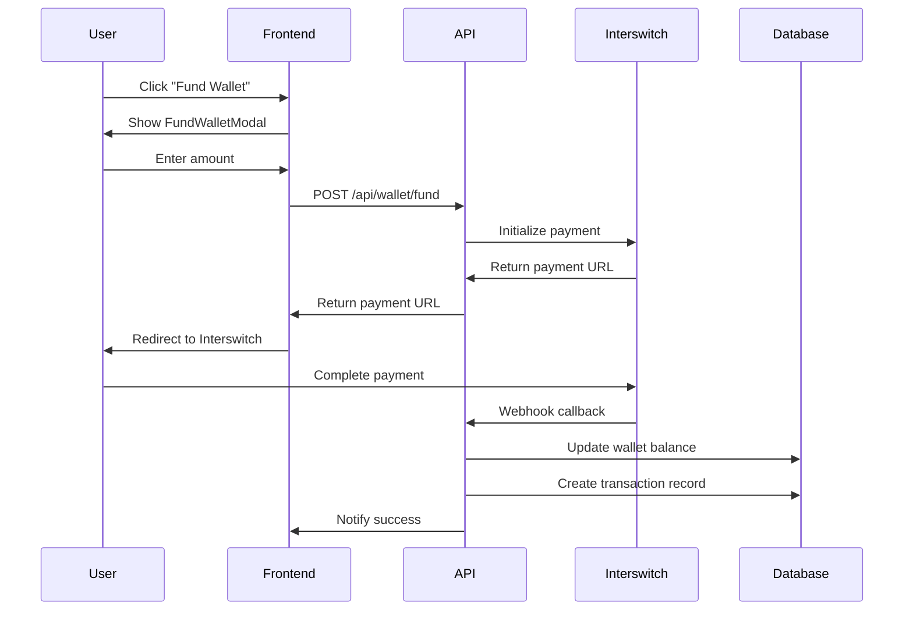
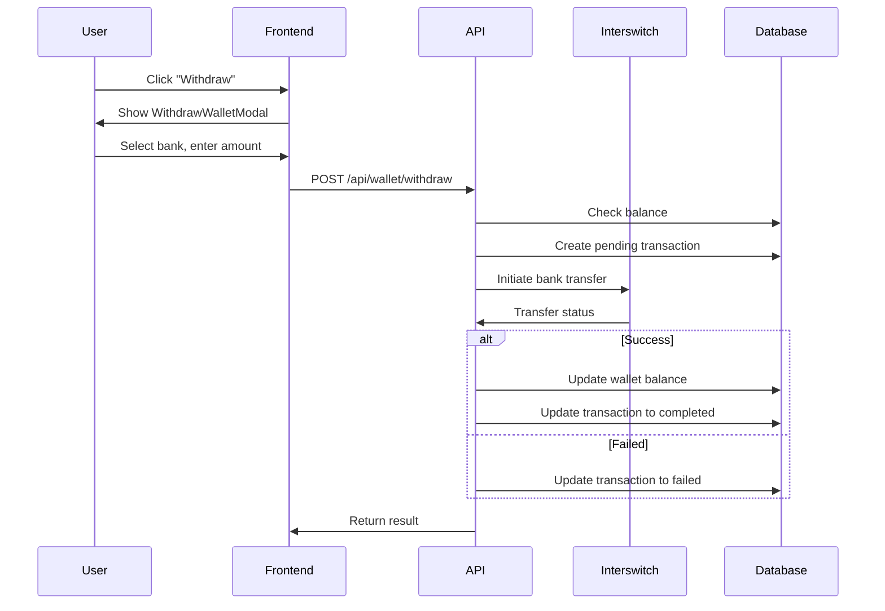
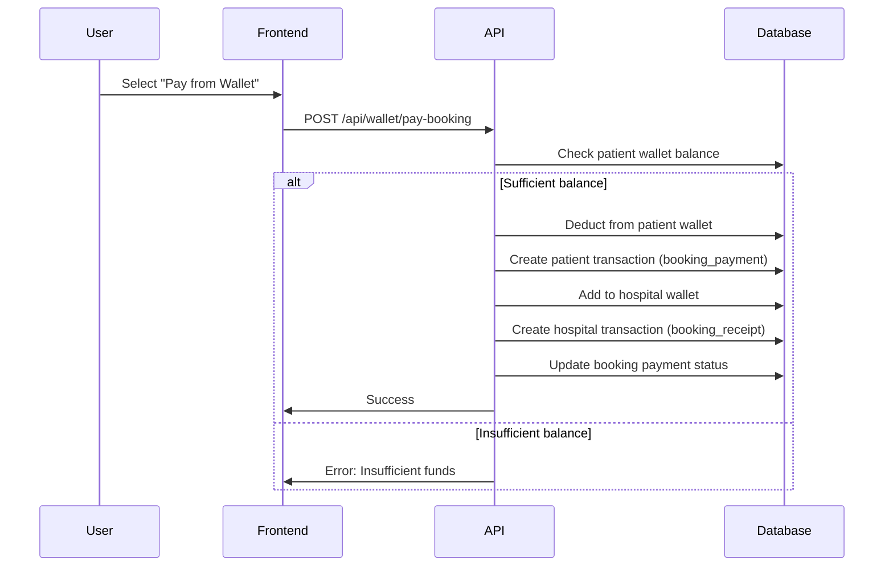

# Wallet Implementation Plan (Patients & Hospitals)

## Overview
Create a full-featured wallet system for both patients and hospitals with funding, withdrawals, transaction history, and direct booking payments using Interswitch payment gateway.

### Role-Based Features:
- **Patients**: Fund wallet, pay for bookings, view transaction history
- **Hospitals**: Receive payments, withdraw to bank, view transaction history

## Database Schema

### 1. `wallets` Table
```sql
CREATE TABLE wallets (
  id UUID PRIMARY KEY DEFAULT gen_random_uuid(),
  user_id UUID NOT NULL REFERENCES profiles(id) ON DELETE CASCADE,
  user_role VARCHAR(20) NOT NULL CHECK (user_role IN ('patient', 'hospital')),
  balance DECIMAL(12, 2) NOT NULL DEFAULT 0.00,
  currency VARCHAR(3) DEFAULT 'NGN',
  is_active BOOLEAN DEFAULT true,
  created_at TIMESTAMP WITH TIME ZONE DEFAULT NOW(),
  updated_at TIMESTAMP WITH TIME ZONE DEFAULT NOW(),
  UNIQUE(user_id)
);

-- Indexes for faster lookups
CREATE INDEX idx_wallets_user_id ON wallets(user_id);
CREATE INDEX idx_wallets_user_role ON wallets(user_role);
```

### 2. `wallet_transactions` Table
```sql
CREATE TABLE wallet_transactions (
  id UUID PRIMARY KEY DEFAULT gen_random_uuid(),
  wallet_id UUID NOT NULL REFERENCES wallets(id) ON DELETE CASCADE,
  transaction_type VARCHAR(50) NOT NULL CHECK (transaction_type IN ('funding', 'withdrawal', 'booking_payment', 'booking_receipt', 'refund', 'transfer')),
  amount DECIMAL(12, 2) NOT NULL,
  balance_after DECIMAL(12, 2) NOT NULL,
  reference VARCHAR(100) NOT NULL UNIQUE, -- Interswitch transaction ref or internal ref
  description TEXT,
  status VARCHAR(20) DEFAULT 'pending' CHECK (status IN ('pending', 'completed', 'failed', 'cancelled')),
  metadata JSONB, -- Additional data like booking_id, bank_details, sender_wallet_id, receiver_wallet_id, etc.
  created_at TIMESTAMP WITH TIME ZONE DEFAULT NOW()
);

-- Indexes for queries
CREATE INDEX idx_wallet_transactions_wallet_id ON wallet_transactions(wallet_id);
CREATE INDEX idx_wallet_transactions_type ON wallet_transactions(transaction_type);
CREATE INDEX idx_wallet_transactions_status ON wallet_transactions(status);
CREATE INDEX idx_wallet_transactions_created_at ON wallet_transactions(created_at DESC);
```

### 3. `bank_accounts` Table (for withdrawals - both patients and hospitals)
```sql
CREATE TABLE bank_accounts (
  id UUID PRIMARY KEY DEFAULT gen_random_uuid(),
  user_id UUID NOT NULL REFERENCES profiles(id) ON DELETE CASCADE,
  user_role VARCHAR(20) NOT NULL CHECK (user_role IN ('patient', 'hospital')),
  bank_name VARCHAR(100) NOT NULL,
  account_number VARCHAR(10) NOT NULL,
  account_name VARCHAR(100) NOT NULL,
  is_default BOOLEAN DEFAULT false,
  is_verified BOOLEAN DEFAULT false,
  created_at TIMESTAMP WITH TIME ZONE DEFAULT NOW(),
  UNIQUE(user_id, account_number)
);

CREATE INDEX idx_bank_accounts_user_id ON bank_accounts(user_id);
CREATE INDEX idx_bank_accounts_user_role ON bank_accounts(user_role);
```

## File Structure

```
app/
├── dashboard/
│   └── patient/
│       └── wallet/
│           └── page.tsx
├── api/
│   └── wallet/
│       ├── balance/
│       │   └── route.ts
│       ├── fund/
│       │   └── route.ts
│       ├── withdraw/
│       │   └── route.ts
│       ├── transactions/
│       │   └── route.ts
│       └── pay-booking/
│           └── route.ts
components/
└── wallet/
    ├── WalletCard.tsx
    ├── TransactionHistory.tsx
    ├── FundWalletModal.tsx
    └── WithdrawWalletModal.tsx
lib/
└── walletService.ts
```

## Component Architecture

### WalletCard Component (Shared)
- Display current wallet balance
- Quick action buttons based on role:
  - Patients: Fund, History
  - Hospitals: Withdraw, History
- Show pending transaction count

### TransactionHistory Component
- Table/list of all transactions
- Filter by type (All, Funding, Withdrawals, Payments, Refunds)
- Filter by status
- Pagination support
- Show transaction details on click

### FundWalletModal Component (Patient only)
- Input amount
- Select payment method (Interswitch)
- Display Interswitch payment form
- Handle payment callback

### WithdrawWalletModal Component (Hospital only)
- Select bank account or add new one
- Input amount (with validation)
- Show available balance
- Confirm withdrawal

### BankAccountCard Component (Shared)
- Display saved bank account
- Set as default option
- Delete account option
- Verification status indicator

## API Routes

### GET /api/wallet/balance
Returns the current wallet balance for the authenticated user.

### POST /api/wallet/fund
Initiates wallet funding via Interswitch payment gateway.

### POST /api/wallet/withdraw
Processes withdrawal request to user's bank account.

### GET /api/wallet/transactions
Returns paginated transaction history with filters.

### POST /api/wallet/pay-booking
Pays for a booking directly from patient's wallet balance.

### GET /api/wallet/bank-accounts
Returns saved bank accounts for the authenticated user.

### POST /api/wallet/bank-accounts
Adds a new bank account for withdrawals.

### DELETE /api/wallet/bank-accounts/[id]
Deletes a bank account.

## Wallet Service Functions

```typescript
// lib/walletService.ts
export async function getWallet(userId: string, role: string): Promise<Wallet>
export async function createWallet(userId: string, role: string): Promise<Wallet>
export async function fundWallet(userId: string, amount: number, reference: string): Promise<WalletTransaction>
export async function withdrawFromWallet(userId: string, amount: number, bankAccountId: string): Promise<WalletTransaction>
export async function getTransactions(userId: string, role: string, filters?: TransactionFilters): Promise<WalletTransaction[]>
export async function payBookingFromWallet(patientId: string, hospitalId: string, bookingId: string, amount: number): Promise<{patientTx: WalletTransaction, hospitalTx: WalletTransaction}>
export async function getBalance(userId: string, role: string): Promise<number>
export async function addBankAccount(userId: string, role: string, accountData: BankAccountData): Promise<BankAccount>
export async function getBankAccounts(userId: string, role: string): Promise<BankAccount[]>
export async function deleteBankAccount(userId: string, accountId: string): Promise<void>
```

## Integration with Interswitch

### Patient Funding Flow


### Hospital Withdrawal Flow


### Booking Payment Flow (Patient to Hospital Transfer)


## Role-Based Access Control

All wallet API routes will:
1. Verify the user is authenticated
2. Check the user's role (patient or hospital)
3. Ensure users can only access their own wallet data
4. Restrict operations based on role:
   - Patients: fund wallet, pay for bookings, view transactions
   - Hospitals: withdraw funds, view transactions, receive payments

## Transaction Types

| Type | Description | Direction | Role |
|------|-------------|-----------|------|
| `funding` | Money added to wallet via Interswitch | Credit | Patient |
| `withdrawal` | Money transferred to bank account | Debit | Hospital |
| `booking_payment` | Payment made for a booking | Debit | Patient |
| `booking_receipt` | Payment received from patient | Credit | Hospital |
| `refund` | Money refunded to wallet | Credit | Patient |
| `transfer` | Internal wallet transfers | Both | Both |

## Transaction Status

| Status | Description |
|--------|-------------|
| `pending` | Transaction initiated, awaiting confirmation |
| `completed` | Transaction successful |
| `failed` | Transaction failed |
| `cancelled` | Transaction cancelled by user |

## Security Considerations

1. **Row Level Security (RLS)**: Enable RLS on wallet tables to ensure users can only access their own data
2. **Transaction Atomicity**: Use database transactions to ensure balance updates and transaction records are consistent
3. **Reference Uniqueness**: Ensure transaction references are unique to prevent duplicate processing
4. **Webhook Verification**: Verify Interswitch webhook signatures to prevent fraud
5. **Rate Limiting**: Implement rate limiting on sensitive operations
6. **Role Validation**: Ensure patients cannot withdraw and hospitals cannot fund via Interswitch

## Edge Cases to Handle

1. **Concurrent Transactions**: Handle race conditions when multiple transactions affect the same wallet
2. **Insufficient Balance**: Validate before allowing withdrawals or payments
3. **Payment Failures**: Handle Interswitch payment failures gracefully
4. **Withdrawal Limits**: Implement minimum and maximum withdrawal amounts for hospitals
5. **Pending Transactions**: Show pending transactions with appropriate status
6. **Hospital Wallet Creation**: Automatically create hospital wallet when hospital is registered
7. **Patient Wallet Creation**: Automatically create patient wallet when patient signs up
8. **Transfer Failures**: Handle cases where patient deduction succeeds but hospital credit fails

## Testing Checklist

### Patient Wallet
- [ ] Wallet creation for new patients
- [ ] Wallet funding via Interswitch
- [ ] Booking payment from wallet
- [ ] Transaction history display
- [ ] Transaction filtering
- [ ] Error handling for insufficient funds

### Hospital Wallet
- [ ] Wallet creation for new hospitals
- [ ] Wallet withdrawal to bank
- [ ] Receiving payments from patients
- [ ] Transaction history display
- [ ] Bank account management (add, delete, set default)
- [ ] Withdrawal limits enforcement

### Shared
- [ ] Role-based access control
- [ ] Webhook callback handling
- [ ] Concurrent transaction handling
- [ ] Transfer atomicity (patient deduction + hospital credit)
